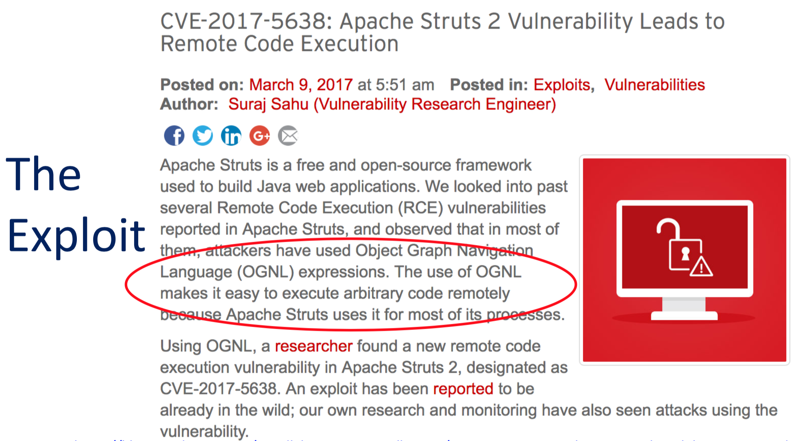

# remote-code-execution-sample
Example shows how to use the Java Security Manager to prevent remote code execution exploits.

## Java Security Manager
 * Due to the JEP below, the specific solution mentioned here of enabling the Java Security Manager is impracticable. However, the ideas here, i.e. employing mandatory access control techniques are still very much applicable to this problem space. 
 * [JEP 411: Deprecate the Security Manager for Removal](https://openjdk.java.net/jeps/411)

## Intro to the Problem

 * Equifax Breach, 143 million Americans’ personal info, including names, addresses, dates of birth and SSNs compromised.
 * Only a veneer of security was in place.
 * Discussed in the first eleven minutes [The Anatomy of a Secure Java Web App](https://www.youtube.com/watch?v=Fdx5Ipv6qoI&list=PLb9He4H6w875eRuh2b4ZccCxBHiZZYTeE&index=10&t=0s). 

## The Exploit

 * The vulnerability *Apache Struts, CVE-2017-5638*.
 * [Equifax confirms Apache Struts security flaw it failed to patch is to blame for hack](http://www.zdnet.com/article/equifax-confirms-apache-struts-flaw-it-failed-to-patch-was-to-blame-for-data-breach/).
 * [CVE-2017-5638: Apache Struts 2 Vulnerability Leads to Remote Code Execution](https://blog.trendmicro.com/trendlabs-security-intelligence/cve-2017-5638-apache-struts-vulnerability-remote-code-execution/).

## How Does The Attack Work?

 * CVE-5638 attackers used Object-Graph Navigation Language (OGNL) expressions in message header. e.g. ```${#_memberAccess["allowStaticMethodAccess"]=true, @java...Runtime@getRuntime().exec('uname -a')}```
 * Input data used in remote code execution exploit.
 * [Behind the Equifax Breach: A Deep Dive Into Apache Struts CVE-2017-5638](https://www.brighttalk.com/webcast/13983/280311?utm_campaign=Twitter&utm_source=brighttalk-sharing&utm_medium=web).

## The Solution

 * Of course you need to ensure all appropriate patches are installed to cover known defects.
 * But what about unknown defects?
 * Employ mandatory access controls like Java Security Manager to your runtime environment.

## Explanation of the code samples

 There are many ways in which a Java Remote Code Execution (RCE) exploit can occur.  One, is during object deserialization, covered by Example #1.  Another is
 when the attacker tricks the Java runtime into executing a system command, via an expression language, like Object-Graph Navigation Language (OGNL), which was
 the attack vector in the Equifax breach (CVE-5638).  Example #2 covers this scenario.

## Example 1 - Instructions Object Serialization Exploit

1. Clone the *remote-code-execution-sample*

 ```
 git clone https://github.com/shawnmckinney/remote-code-execution-sample.git
 ```

2. Edit *my-java.policy* file, point to project source folder:

 ```
 vi src/main/resources/my-java.policy
 ...
 grant codeBase "file:${user.home}/Development/remote-code-execution-sample/-" {
 ```

 For example, if you cloned into */home/myuser/Development*, it would look like this:

 ```
 grant codeBase "file:${user.home}/Development/remote-code-execution-sample/-" {
 ```

 Of course this all depends on the user's home dir locale, under which the java program runs. If you're not sure, use an absolute path:
 ```
 grant codeBase "file:/home/myuser/Development/remote-code-execution-sample/-" {
 ```

3. Build and run the test program.  Make sure the *-Dremote-code-execution-sh* points to the correct folder on your machine:

 ```
 mvn clean install
 java -cp target/remoteCodeExecutionSample-1.0.0.jar
      -Djava.security.manager
      -Djava.security.policy=src/main/resources/my-java.policy
      -Dremote-code-execution-sh=/home/myuser/Development/remote-code-execution-sample/src/main/resources/hacker-script.sh
      com.example.App
 ```

4. Examine the program output.

 ```
 Begin serial exploit test....
 Input: duke moscone center
 Serialized data is saved in myObject.ser
 BadCode will now run hacker script
 user.home=/home/myuser
 execute hacker command=/home/myuser/Development/remote-code-execution-sample/src/main/resources/hacker-script.sh
 system command has been run....
 Result: foo fighters!
 ```

5. Examine the files in package:
 ```
 myuser@ubuntu:~/Development/remote-code-execution-sample$ ls
 total 32
 LICENSE
 myObject.ser                <--- this file is new but supposed to be there
 pom.xml
 README.md
 src
 target
 YouveBeenHacked             <--- this file is new but should not be here.
 ```

6. View the contents of *YouveBeenHacked*:

 ```
 myuser@ubuntu:~/Development/remote-code-execution-sample$ cat YouveBeenHacked
 root:x:0:0:root:/root:/bin/bash
 daemon:x:1:1:daemon:/usr/sbin:/usr/sbin/nologin
 ...
 ```

7. What just happened?  If the test was *successful*, a rogue script executed and copied the contents of /etc/passwd to its file *YouveBeenHacked*. An example of how a system command can be executed during that operation.

8. Now change the policy.  Edit my-java.policy, comment out the permission to allow the script to execute:

 ```
 vi src/main/resources/my-java.policy
 ...
 grant codeBase "file:${user.home}/Development/remote-code-execution-sample/-" {
 // must specifically allow file to execute:
 //permission java.io.FilePermission "./src/main/resources/hacker-script.sh", "execute";
 ```

9. Rerun the program and view the output:

 ```
 myuser@ubuntu:~/Development/remote-code-execution-sample$ java -cp target/remoteCodeExecutionSample-1.0.0.jar -Djava.security.manager -Djava.security.policy=src/main/resources/my-java.policy -Dremote-code-execution-sh=/home/myuser/Development/remote-code-execution-sample/src/main/resources/hacker-script.sh com.example.App
 Begin serial exploit test....
 Input: duke moscone center
 Serialized data is saved in myObject.ser
 BadCode will now run hacker script
 user.home=/home/myuser
 execute hacker command=/home/myuser/Development/remote-code-execution-sample/src/main/resources/hacker-script.sh
 Exception in thread "main" java.security.AccessControlException: access denied ("java.io.FilePermission" "/home/myuser/Development/remote-code-execution-sample/src/main/resources/hacker-script.sh" "execute")
	at java.security.AccessControlContext.checkPermission(AccessControlContext.java:472)
	at java.security.AccessController.checkPermission(AccessController.java:884)
	at jav
 ```

 The rogue program cannot execute a system command if that specific permission hasn't been added to its codebase in the java.policy.

10. Now reenable the permission in my-java.policy but remove the unix file permission to execute, rerun program.

 ```
 myuser@ubuntu:~/Development/remote-code-execution-sample$ chmod a-x src/main/resources/hacker-script.sh
 myuser@ubuntu:~/Development/remote-code-execution-sample$ java -cp target/remoteCodeExecutionSample-1.0.0.jar -Djava.security.manager -Djava.security.policy=src/main/resources/my-java.policy -Dremote-code-execution-sh=/home/myuser/Development/remote-code-execution-sample/src/main/resources/hacker-script.sh com.example.App
 Begin serial exploit test....
 Input: duke moscone center
 Serialized data is saved in myObject.ser
 BadCode will now run hacker script
 user.home=/home/myuser
 execute hacker command=/home/myuser/Development/remote-code-execution-sample/src/main/resources/hacker-script.sh
 ERROR: serialize caught IOException=java.io.IOException: Cannot run program "/home/myuser/Development/remote-code-execution-sample/src/main/resources/hacker-script.sh"
 Exception in thread "main" java.lang.RuntimeException: serialize caught IOException=java.io.IOException: Cannot run program "/home/myuser/Development/remote-code-execution-sample/src/main/resources/hacker-script.sh"
 	at com.example.App.deserialize(App.java:67)
 	at com.example.App.main(App.java:26)
 ```

 Now the program cannot execute the script because of common unix file permission.

11. The takeaway?

 Usage of the Java Security Manager and strict unix file system controls can limit the damage that can be inflicted during Java object deserialzation - specifically preventing a remote code execution vulnerability.

12. Run with Java Security Manager debug enabled:

 ```
 mvn clean install
 java -cp target/remoteCodeExecutionSample-1.0.0.jar
 ...
      -Djava.security.debug="access,failure"     <--- add this param
      com.example.App
 ```

 and view the output:

 ```
 myuser@ubuntu:~/Development/remote-code-execution-sample$ java -cp target/remoteCodeExecutionSample-1.0.0.jar -Djava.security.manager -Djava.security.policy=src/main/resources/my-java.policy -Dremote-code-execution-sh=/home/myuser/Development/remote-code-execution-sample/src/main/resources/hacker-script.sh -Djava.security.debug="access,failure" com.example.App
 Begin serial exploit test....
 Input: duke moscone center
 access: access allowed ("java.io.FilePermission" "/home/myuser/Development/remote-code-execution-sample/target/remoteCodeExecutionSample-1.0.0.jar" "read")
 access: access allowed ("java.util.PropertyPermission" "sun.io.serialization.extendedDebugInfo" "read")
 access: access allowed ("java.lang.RuntimePermission" "reflectionFactoryAccess")
 access: access allowed ("java.lang.reflect.ReflectPermission" "suppressAccessChecks")     <-- this one you should be wary of.
 ...
 ```

 There's tons of useful forensic information contained within this output.  Take the time to understand all of the commands your program is invoking. It'll help you understand the req's to secure it.

 13. To run inside IDE (optional) - if you are running inside of an integrated development environment like eclipse, netbeans or intellij, add additional codebase to my-java.policy:

 ```
 // Optional, If running this sample inside an IDE, it gets configured something like this.... (for intellij):
 grant codeBase "file:${user.home}/JavaTools/idea-IC-139.659.2/lib/idea_rt.jar" {
   permission java.util.PropertyPermission "*", "read";
   permission java.lang.RuntimePermission "*";
   permission java.lang.reflect.ReflectPermission "suppressAccessChecks";
   permission java.io.FilePermission "myObject.ser", "write";
   permission java.io.FilePermission "myObject.ser", "read";
   permission java.net.SocketPermission "localhost:*", "listen,resolve";
   permission java.io.FilePermission "<<ALL FILES>>", "execute";
 };
 ```

## Example 2 - Instructions Remote Code Execution Exploit

1. Build and run the test program 2:

 ```
 mvn clean install
 java -cp target/remoteCodeExecutionSample-1.0.0.jar
      -Djava.security.manager
      -Djava.security.policy=src/main/resources/my-java.policy
      com.example.App2
 ```

2. Examine the program output.

 ```
 Begin runtime command test...
 Linux ubuntu 3.13.0-132-generic #181-Ubuntu SMP Wed Sep 13 13:25:03 UTC 2017 x86_64 x86_64 x86_64 GNU/Linux
 ```

3. What just happened?  If the test was *successful*, the test program was able to call the Linux runtime with a 'uname' command.  This rather benign example illustrates
 what happen during a remote code execution (RCE) attack.  The caller tricks the program into executing an expression which then invokes the Java runtime.


4. Now change the policy.  Edit my-java.policy, comment out the permission to allow the script to execute:

 ```
 vi src/main/resources/my-java.policy
 ...
 grant codeBase "file:${user.home}/Development/remote-code-execution-sample/-" {
  // if runtime calls uname fully qualified:
  //permission java.io.FilePermission "/bin/uname", "execute";
 ```

5. Rerun the program and view the output:

 ```
 myuser@ubuntu:~/Development/remote-code-execution-sample$ java -cp target/remoteCodeExecutionSample-1.0.0.jar -Djava.security.manager -Djava.security.policy=src/main/resources/my-java.policy com.example.App2
 com.example.App2
 Begin runtime command test...
 Exception in thread "main" java.security.AccessControlException: access denied ("java.io.FilePermission" "/bin/uname" "execute")
	at java.security.AccessControlContext.checkPermission(AccessControlContext.java:472)
	at java.security.AccessController.checkPermission(AccessController.java:884)
	at java.lang.SecurityManager.checkPermission(SecurityManager.java:549)
	at java.lang.SecurityManager.checkExec(SecurityManager.java:796)
	at java.lang.ProcessBuilder.start(ProcessBuilder.java:1018)
	at java.lang.Runtime.exec(Runtime.java:620)
	at java.lang.Runtime.exec(Runtime.java:450)
	at java.lang.Runtime.exec(Runtime.java:347)
	at com.example.App2.main(App2.java:22)
 ```

 The rogue program cannot execute a system command if that specific permission hasn't been added to its codebase in the java.policy.

6. Now, run the App3 program, which is identical to App2, except the uname is called without a fully qualified path:

 ```
 myuser@ubuntu:~/Development/remote-code-execution-sample$ java -cp target/remoteCodeExecutionSample-1.0.0.jar -Djava.security.manager -Djava.security.policy=src/main/resources/my-java.policy com.example.App3
 Begin runtime command test 3...
 Linux ubuntu 3.13.0-132-generic #181-Ubuntu SMP Wed Sep 13 13:25:03 UTC 2017 x86_64 x86_64 x86_64 GNU/Linux
 Exception in thread "main" java.security.AccessControlException: access denied ("java.io.FilePermission" "<<ALL FILES>>" "execute")
	at java.security.AccessControlContext.checkPermission(AccessControlContext.java:472)
	at java.security.AccessController.checkPermission(AccessController.java:884)
	at java.lang.SecurityManager.checkPermission(SecurityManager.java:549)
	at java.lang.SecurityManager.checkExec(SecurityManager.java:799)
	at java.lang.ProcessBuilder.start(ProcessBuilder.java:1018)
	at java.lang.Runtime.exec(Runtime.java:620)
	at java.lang.Runtime.exec(Runtime.java:450)
	at java.lang.Runtime.exec(Runtime.java:347)
	at com.example.App3.main(App3.java:22)
 ```

7. Now, enable the following permission in my-java.policy.

 ```
 grant codeBase "file:${user.home}/Development/remote-code-execution-sample/-" {
  // if runtime called without a fully qualified path:
  permission java.io.FilePermission "<<ALL FILES>>", "execute";
 ```

8. And run the App3 test which calls uname without a fully qualified path:

 ```
 myuser@ubuntu:~/Development/remote-code-execution-sample$ java -cp target/remoteCodeExecutionSample-1.0.0.jar -Djava.security.manager -Djava.security.policy=src/main/resources/my-java.policy com.example.App3
 Begin runtime command test 3...
 Linux ubuntu 3.13.0-132-generic #181-Ubuntu SMP Wed Sep 13 13:25:03 UTC 2017 x86_64 x86_64 x86_64 GNU/Linux
 ```

9. Now, what happened?  We've just handed the Java runtime permission to execute any file on the system available to the Java process it's running under.  Of course we wouldn't
 do that in the real world.  Running without Java Security Manager
 enabled is like rolling the dice with the safety and security of the system.  We'll never be 100% certain any given application, and all of its dependencies, are free of (undiscovered) vulnerabilities.

## Parting thoughts

The Java Security Manager is not a perfect solution.  There are caveats.  For example, parsing data using standard parsers means you will have to add this permission:

 ```
 permission java.lang.reflect.ReflectPermission "suppressAccessChecks";
 ```

 Which opens vulnerabilities in your program by breaking encapsulation barriers -- via reflection.

 Java 9++ changes help...
   * Modularization
   * Improved encapsulation
   * Finer control over package access.
